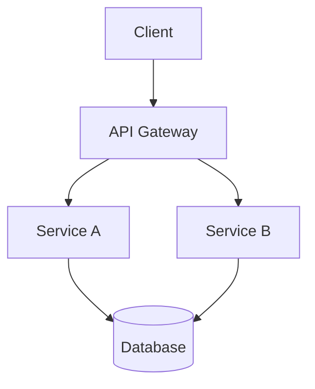

# Architecture

> *Replace this with your project's architecture documentation.*

This document describes the system architecture, key design decisions, and component relationships.

## Overview

*Brief description of the system and its purpose.*

## Architecture Diagram

## Core Components

### [Component 1]
- **Purpose:** 
- **Technology:** 
- **Location:** 

### [Component 2]
- **Purpose:** 
- **Technology:** 
- **Location:** 

## Data Flow

*Describe the primary data flows through the system.*

## Deployment

- **Hosting:** 
- **CI/CD:** 
- **Environment Variables:** See `.env.example`

## Decisions

See `docs/decisions/` for Architecture Decision Records (ADRs) that document key technical choices.
